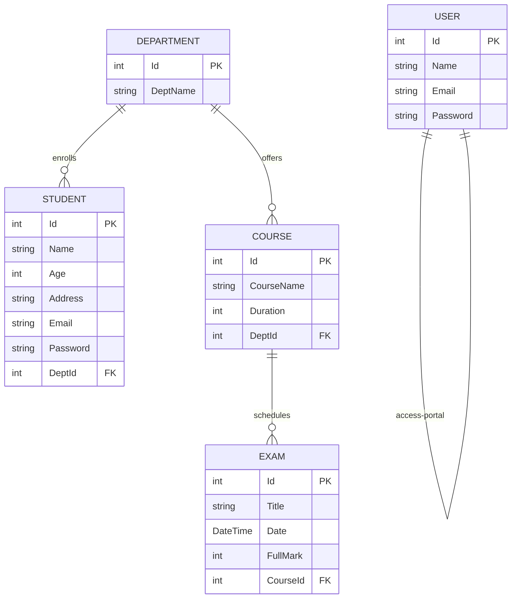

# 🎓 Students Education Platform

Welcome to the **Students Education Platform**, a modern, web-based system designed to manage student registration, departmental organization, courses, exams, and portals for both students and administrators. This application is built as the **ITI Final Project** by **Omar Ahmed**, leveraging the latest features of **ASP.NET Core 9.0 MVC** and **Entity Framework Core**.

---

## 📋 Table of Contents
1. [Key Features](#-key-features)
2. [Technology Stack](#%EF%B8%8F-technology-stack)
3. [Architecture & Folder Structure](#%EF%B8%8F-architecture--folder-structure)
4. [Data Model & Seed Data](#-data-model--seed-data)
5. [Security & Validation](#-security--validation)
6. [Getting Started & Installation](#%EF%B8%8F-getting-started--installation)
7. [API & Controller Endpoints](#-api--controller-endpoints)

---

## 🌟 Key Features

### 👤 User Roles & Authentication
* **Student Role**: Students can register, log in, view details of their profile, and explore departments/courses.
* **Admin / General User Role**: Administrators have access to register new users, manage student information, oversee courses, and schedule exams.
* **Session-Based Authentication**: Secure state tracking via ASP.NET Core Sessions with HTTP-only cookies and automatic timeout configurations.

### 🏫 Department Management
* CRUD operations to define and manage academic departments (e.g., `SOC`, `Asp .NET`, `IS`, `Laravel`, `Cyber Security`, `CS`, `Front-End`).
* Tracks the relationship between departments, enrolled students, and offered courses.

### 📚 Course Management
* Cataloging of courses with academic durations in hours.
* Connects courses directly to their respective hosting departments and associated exams.

### ✍️ Exam Scheduling & Management
* Allows administrators to schedule exams, set exam dates, assign full marks, and map exams to specific courses.

---

## 🛠️ Technology Stack

* **Backend Framework**: [ASP.NET Core 9.0 MVC](file:///c:/Users/omars/source/repos/Students_Education_Platform/Program.cs)
* **Database Provider**: [Entity Framework Core 9.0.10](file:///c:/Users/omars/source/repos/Students_Education_Platform/Students_Education_Platform.csproj) (SQL Server)
* **Session Management**: Native ASP.NET Session Cookies
* **Frontend**: HTML5, CSS3, JavaScript, jQuery, and Bootstrap 5
* **Design & Layout**: "Agency" responsive landing page layout template featuring modern gradients, Google Fonts (Montserrat & Roboto Slab), and smooth transitions

---

## 🗂️ Architecture & Folder Structure

The project follows a standard ASP.NET Core MVC architectural pattern:

* **[Solution File](file:///c:/Users/omars/source/repos/Students_Education_Platform.sln)**: Solution coordinator for the project.
* **[Controllers/](file:///c:/Users/omars/source/repos/Students_Education_Platform/Controllers)**: Contains endpoints and routing logic.
  * [AuthController.cs](file:///c:/Users/omars/source/repos/Students_Education_Platform/Controllers/AuthController.cs): Controls registration, logins, and session timeouts.
  * [StudentController.cs](file:///c:/Users/omars/source/repos/Students_Education_Platform/Controllers/StudentController.cs): Coordinates CRUD operations for students.
  * [CoursesController.cs](file:///c:/Users/omars/source/repos/Students_Education_Platform/Controllers/CoursesController.cs): Oversees the courses database.
  * [ExamController.cs](file:///c:/Users/omars/source/repos/Students_Education_Platform/Controllers/ExamController.cs): Manages exams and schedules.
  * [DepartmentController.cs](file:///c:/Users/omars/source/repos/Students_Education_Platform/Controllers/DepartmentController.cs): Handles departmental lookups.
  * [UserController.cs](file:///c:/Users/omars/source/repos/Students_Education_Platform/Controllers/UserController.cs): Oversees system users and admin portals.
* **[Models/](file:///c:/Users/omars/source/repos/Students_Education_Platform/Models)**: Business entities and DbContext definitions.
  * [MyContext.cs](file:///c:/Users/omars/source/repos/Students_Education_Platform/Models/MyContext.cs): Seed data configurations, EF Fluent configurations, and relationship mappings.
  * [Student.cs](file:///c:/Users/omars/source/repos/Students_Education_Platform/Models/Student.cs): Student data model with validation.
  * [Department.cs](file:///c:/Users/omars/source/repos/Students_Education_Platform/Models/Department.cs): Department data model.
  * [Course.cs](file:///c:/Users/omars/source/repos/Students_Education_Platform/Models/Course.cs): Course schema and configurations.
  * [Exam.cs](file:///c:/Users/omars/source/repos/Students_Education_Platform/Models/Exam.cs): Exam schema and validation.
  * [User.cs](file:///c:/Users/omars/source/repos/Students_Education_Platform/Models/User.cs): General user schema and validation.
* **[Views/](file:///c:/Users/omars/source/repos/Students_Education_Platform/Views)**: Razer View markup templates (.cshtml) grouped by controller actions.
  * [Shared/Home_Layout.cshtml](file:///c:/Users/omars/source/repos/Students_Education_Platform/Views/Shared/Home_Layout.cshtml): Shared layout template featuring the main Bootstrap navigation, hero masthead, portfolio sections, team directories, and footer design.

---

## 🗄️ Data Model & Seed Data

The relationships among entities are configured via Entity Framework and stored within [MyContext.cs](file:///c:/Users/omars/source/repos/Students_Education_Platform/Models/MyContext.cs). 



### Initial Seed Data
The database context pre-populates several records to ease manual verification:
* **Departments**: SOC, Asp .NET, IS, Laravel, Cyber Security, CS, Front-End
* **Students**: Standard test accounts (e.g., `omar` under IS, `ahmed` under Asp .NET)
* **Courses**: OOP, Database & SQL, .Net Basics, Network Security, HTML & CSS & JS
* **Exams**: "OOP Final Exam", "SQL Practical Exam", etc.

---

## 🔒 Security & Validation

1. **Input Validation**: Model attributes utilize standard data annotations like `[Required]`, `[MinLength]`, `[Range]`, `[EmailAddress]`, and `[Compare]` for frontend-backend validation consistency (e.g., password matching).
2. **Session Security**: Session cookies are configured in [Program.cs](file:///c:/Users/omars/source/repos/Students_Education_Platform/Program.cs) as `HttpOnly` and `IsEssential` with a 30-minute slide time window:
   ```csharp
   builder.Services.AddSession(options =>
   {
       options.IdleTimeout = TimeSpan.FromMinutes(30);
       options.Cookie.HttpOnly = true;
       options.Cookie.IsEssential = true;
   });
   ```
3. **Role-Based Redirection**: Logins evaluate the context of the user type (Student vs Admin/User) and configure session variables `UserType`, `UserId`, `UserName`, and `UserEmail` to customize view layout navigation options.

---

## ⚙️ Getting Started & Installation

### Prerequisites
* [.NET 9.0 SDK](https://dotnet.microsoft.com/en-us/download/dotnet/9.0)
* [SQL Server / LocalDB](https://www.microsoft.com/en-us/sql-server/sql-server-downloads)

### Installation Steps

1. **Clone the Repository**:
   ```bash
   git clone https://github.com/Omar-SallaM0/Students-Platform.git
   cd Students-Platform
   ```

2. **Database Connection Setup**:
   Open [MyContext.cs](file:///c:/Users/omars/source/repos/Students_Education_Platform/Models/MyContext.cs) and verify/update the database connection string:
   ```csharp
   optionsBuilder.UseSqlServer("Server=OMAR;database=FinalProjectITI;trusted_connection=true;trustServerCertificate=true");
   ```

3. **Apply Database Migrations**:
   Execute the EF migrations to create the database schema and seed tables:
   ```bash
   dotnet ef database update
   ```

4. **Run the Application**:
   Startup the local Kestrel development web server:
   ```bash
   dotnet run --project Students_Education_Platform
   ```

5. **Access the Portal**:
   Open your browser and navigate to `http://localhost:5000` or the SSL enabled port shown in the console outputs.

---

## 🛣️ API & Controller Endpoints

| Area / Controller | Action | Method | Description |
| :--- | :--- | :--- | :--- |
| **Auth** | `Login` | GET/POST | Logs in a Student or Admin User, establishing sessions |
| **Auth** | `Register` | GET | Displays register tabs for Students and Admins |
| **Auth** | `Logout` | GET | Clears session data and redirects to homepage |
| **Student** | `Getall` | GET | Lists all registered students |
| **Student** | `CreateStudent` | GET/POST | Standard student CRUD forms |
| **Courses** | `Index` | GET | Lists available courses |
| **Exam** | `Index` | GET | Exam schedule catalog |
| **Department** | `GetallDepartment` | GET | Department layout directory |
